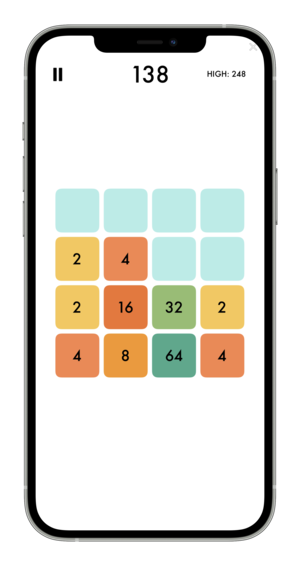

# 2048 game in Python
I've challenged myself to build a "2048" game ONLY using my phone.  
To run this game on your device you need:
- [Pythonista 3](https://apps.apple.com/us/app/pythonista-3/id1085978097?ls=1) app from AppStore
- put _2048.py_ into Examples/Games folder

